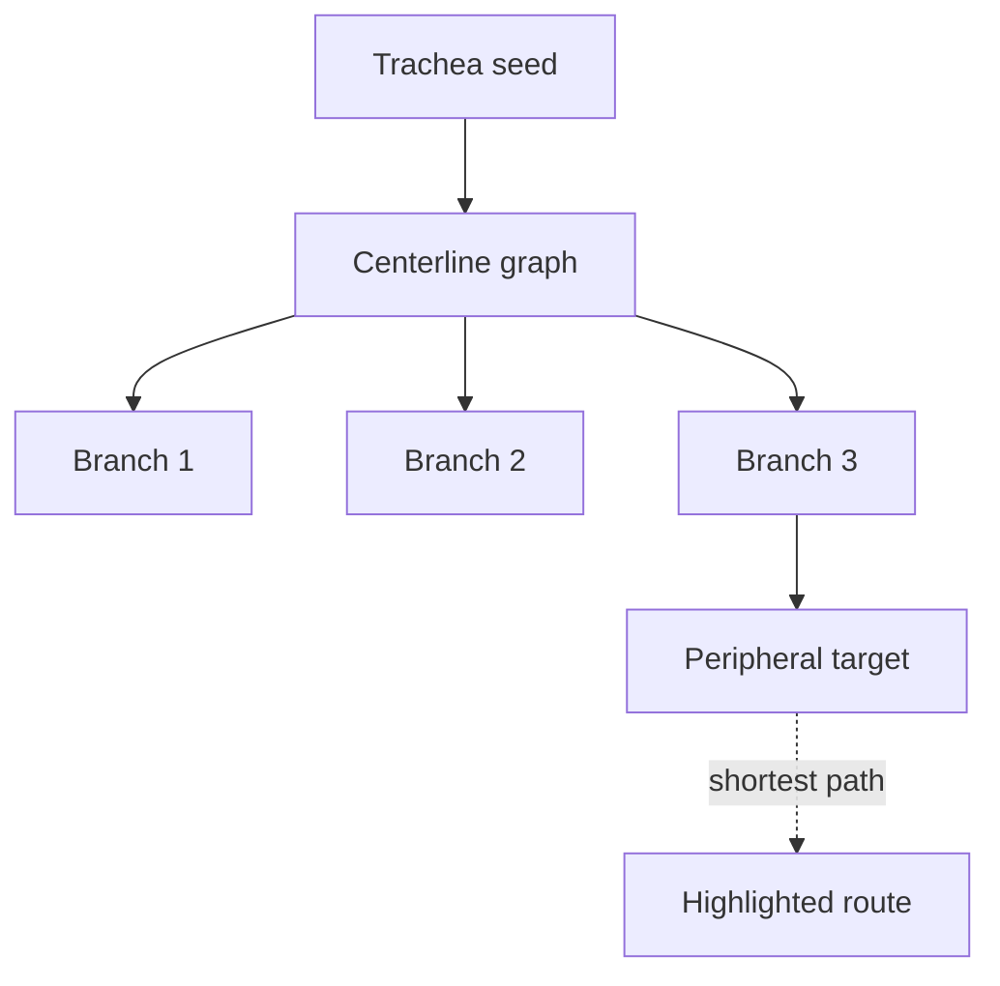

# LungVolSeg: A Reproducible Full-Volume Lung CT Segmentation and Surface Export Pipeline

## Abstract

**Background:** CT-based planning for lung navigation workflows depends on reliable volumetric preprocessing, segmentation, surface extraction, and validation. This project implements a compact, reproducible pipeline for full-volume chest CT lung segmentation using open-source medical imaging tools.

**Objective:** The objective was to build a working engineering pipeline that downloads a public real CT dataset, prepares 3D volumes, trains a 3D segmentation model, exports anatomical surfaces, computes validation metrics, and generates documentation artifacts suitable for navigation-prep experimentation.

**Methods:** The pipeline uses the COVID-19 CT Lung and Infection Segmentation Dataset from Zenodo, containing 20 labeled CT scans. Lung masks are converted into a binary lung segmentation target. SimpleITK handles image IO, cropping, normalization, and resampling. MONAI provides a 3D UNet segmentation model and training/inference utilities. VTK converts predicted labels into 3D mesh surfaces exported as `.stl` and `.vtp`. Validation uses Dice similarity and 95th percentile Hausdorff distance.

**Results:** A full run on all 20 CT cases trained for 25 epochs produced a mean lung Dice score of `0.9243`, mean lung HD95 of `10.5909`, and best validation Dice of `0.9539`. The pipeline generated checkpoints, predictions, VTK meshes, metrics, and a model card.

**Conclusion:** The project provides a complete real-data lung CT navigation-prep pipeline with reproducible dataset download, model training, mesh export, and validation. The current implementation is intended for research and engineering demonstration, not clinical use.

## Introduction

Robotic bronchoscopy and related lung navigation workflows rely on CT-derived anatomical understanding. Before navigation, a CT scan is commonly used for planning, segmentation, registration, and 3D visualization. A practical navigation-prep pipeline should therefore handle medical image spatial metadata, support 3D segmentation, produce geometric surfaces, and report quantitative validation metrics.

This project focuses on the engineering substrate for that workflow. The goal is not to claim clinical performance, but to demonstrate an end-to-end reproducible pipeline built from commonly used medical imaging tools:

- SimpleITK for medical image IO and spatial preprocessing
- MONAI for 3D medical image segmentation
- VTK for surface extraction and mesh export
- PyTorch for model optimization

The first real-data target is binary lung segmentation from full-volume CT scans. Lung segmentation is a useful navigation-prep target because it provides a stable organ-level anatomical surface and avoids the severe imbalance of small lesion labels.

## Methods

### Dataset

The pipeline uses the **COVID-19 CT Lung and Infection Segmentation Dataset** hosted on Zenodo.

- Zenodo record: `https://zenodo.org/records/3757476`
- DOI: `10.5281/zenodo.3757476`
- License: `CC-BY-4.0`
- Cases: 20 labeled full CT scans
- Downloaded archives: `COVID-19-CT-Seg_20cases.zip` and `Lung_Mask.zip`

The original dataset includes left lung, right lung, and infection annotations. This implementation converts the lung masks into a binary target:

- `0`: background
- `1`: lung

This choice was made because binary lung segmentation is the strongest fit for CT navigation-prep surface generation and provides a stable validation target for a compact engineering run.

### Pipeline Overview

The primary command is:

```bash
python3 scripts/run_zenodo_lung_pipeline.py \
  --workspace outputs/zenodo_lung \
  --epochs 8 \
  --target-depth 96 \
  --target-height 128 \
  --target-width 128
```

The same code is mirrored under root `code/`:

```bash
PYTHONPATH=code python3 code/scripts/run_zenodo_lung_pipeline.py \
  --workspace outputs/zenodo_lung \
  --epochs 8
```

The workflow performs the following steps:

1. Download CT and lung-mask archives from Zenodo.
2. Verify archive MD5 checksums.
3. Extract NIfTI volumes.
4. Pair CT volumes with lung masks.
5. Crop around the lung-mask bounding box.
6. Clip CT intensities to `[-1000, 400]` HU and normalize to `[0, 1]`.
7. Resize each case to a compact 3D target shape.
8. Train a MONAI 3D UNet.
9. Run inference on prepared cases.
10. Export predicted lung surfaces as `.stl` and `.vtp`.
11. Compute Dice and HD95 metrics.
12. Generate a model card.

### Preprocessing

Images are loaded with SimpleITK and converted to NumPy arrays in `z, y, x` order. Lung masks are binarized so that any nonzero lung annotation becomes foreground. The pipeline computes a lung bounding box with a small margin, crops the CT and mask to that region, clips CT intensity values to a lung-appropriate window, normalizes intensities, and resizes volumes to a configured target shape.

The default target shape is:

```text
96 x 128 x 128
```

The smaller validation run used:

```text
64 x 96 x 96
```

### Model

The model is a MONAI 3D UNet with:

- `spatial_dims=3`
- `in_channels=1`
- `out_channels=2`
- channels `(16, 32, 64, 128)`
- strides `(2, 2, 2)`
- two residual units per level
- dropout `0.1`

Training uses Dice plus cross-entropy loss through MONAI's `DiceCELoss`, with Adam optimization and learning rate `1e-3`.

### Inference and Surface Export

Inference uses MONAI sliding-window inference with a window matching the prepared target shape. Predicted class labels are written back as NIfTI volumes with SimpleITK.

VTK extracts mesh surfaces from predicted labels using discrete marching cubes, applies windowed-sinc smoothing, and writes:

- `lung.stl`
- `lung.vtp`

Preview rendering is disabled by default because many server and CI environments do not provide a working X/GL context.

### Validation Metrics

Validation computes:

- Dice similarity coefficient for the lung foreground class
- 95th percentile Hausdorff distance for the lung foreground class

Metrics are saved to:

```text
outputs/zenodo_lung/metrics.json
```

## Results

A completed full run was executed with:

```bash
python3 scripts/run_zenodo_lung_pipeline.py \
  --workspace outputs/zenodo_lung_full_e25 \
  --epochs 25 \
  --target-depth 96 \
  --target-height 128 \
  --target-width 128
```

The run completed end to end and generated:

- prepared NIfTI cases
- model checkpoint
- prediction volumes
- VTK lung meshes
- metrics JSON
- model card

### Quantitative Results

| Case | Dice Lung | HD95 Lung |
|---|---:|---:|
| `zenodo_lung_001` | 0.9921 | 1.0000 |
| `zenodo_lung_002` | 0.9848 | 5.0000 |
| `zenodo_lung_003` | 0.9797 | 5.0000 |
| `zenodo_lung_004` | 0.9880 | 4.0000 |
| `zenodo_lung_005` | 0.9877 | 4.0000 |
| `zenodo_lung_006` | 0.9926 | 1.0000 |
| `zenodo_lung_007` | 0.9893 | 1.4142 |
| `zenodo_lung_008` | 0.9908 | 1.0000 |
| `zenodo_lung_009` | 0.9916 | 1.0000 |
| `zenodo_lung_010` | 0.9886 | 1.0000 |
| `zenodo_lung_011` | 0.8636 | 20.0000 |
| `zenodo_lung_012` | 0.8589 | 18.0000 |
| `zenodo_lung_013` | 0.8678 | 14.6287 |
| `zenodo_lung_014` | 0.8778 | 19.6214 |
| `zenodo_lung_015` | 0.9030 | 19.7484 |
| `zenodo_lung_016` | 0.8414 | 18.4120 |
| `zenodo_lung_017` | 0.7808 | 16.7631 |
| `zenodo_lung_018` | 0.8866 | 20.8087 |
| `zenodo_lung_019` | 0.8747 | 20.4206 |
| `zenodo_lung_020` | 0.8456 | 19.0000 |
| **Mean** | **0.9243** | **10.5909** |

The first half of the dataset is near-perfect, while a weaker subgroup appears in the second half. That pattern suggests structured case difficulty rather than random optimization noise.

## Discussion

The pipeline demonstrates a practical path from real CT data to navigation-prep artifacts. The lung segmentation target provides a useful 3D anatomical boundary that can be exported for visualization, QA, registration experiments, and planning-interface prototypes.

Several engineering choices were made to keep the project reproducible and tractable:

- The dataset is downloaded by script instead of stored in Git.
- MD5 checks verify archive integrity.
- Generated data and outputs are ignored by Git.
- The model uses compact 3D volumes to keep training feasible on limited hardware.
- Mesh export is included in the main pipeline rather than treated as a separate visualization demo.

The 25-epoch full run shows that the pipeline can achieve strong lung overlap on this dataset with a compact 3D UNet. The weaker subgroup of cases indicates that the current preprocessing and split strategy are not uniformly robust across the full dataset, so the next evaluation should keep a fixed held-out protocol and inspect the lower-performing cases directly.

## Limitations

This work has several limitations:

- The reported top-line result averages predictions over all 20 prepared cases, not a strict external test set.
- The default pipeline performs compact resizing, which sacrifices native scanner resolution.
- The current evaluation uses an internal `13 / 7` train/validation split determined by script order and should be hardened into an explicit protocol.
- The segmentation target is binary lung, not airway, vessel, lobe, or lesion navigation anatomy.
- The generated meshes are suitable for engineering demonstration but are not validated for procedural planning.
- The project is not a medical device and is not intended for clinical decision-making.

## Reproducibility

Install dependencies:

```bash
python3 -m pip install -r requirements.txt
python3 -m pip install -e .
```

Run the documented full pipeline:

```bash
python3 scripts/run_zenodo_lung_pipeline.py \
  --workspace outputs/zenodo_lung_full_e25 \
  --epochs 25 \
  --target-depth 96 \
  --target-height 128 \
  --target-width 128
```

Run the smaller validation configuration:

```bash
python3 scripts/run_zenodo_lung_pipeline.py \
  --workspace outputs/zenodo_lung_smoke \
  --epochs 2 \
  --target-depth 64 \
  --target-height 96 \
  --target-width 96 \
  --max-cases 4
```

Run from the mirrored root code:

```bash
PYTHONPATH=code python3 code/scripts/run_zenodo_lung_pipeline.py \
  --workspace outputs/zenodo_lung \
  --epochs 8
```

## Data and Code Availability

The dataset is publicly available from Zenodo:

```text
https://zenodo.org/records/3757476
```

The working code is available in two layouts:

- installable package: `src/lungvolseg/`
- root mirror: `code/lungvolseg/`

Command-line entrypoints are available in:

- `scripts/`
- `code/scripts/`

## Conclusion

This project implements a real-data, full-volume lung CT segmentation pipeline for navigation-prep engineering. It downloads a public CT dataset, prepares 3D volumes, trains a MONAI segmentation model, exports VTK lung surfaces, computes validation metrics, and generates documentation artifacts. The documented full run demonstrates end-to-end operation with mean lung Dice of `0.9243` and best validation Dice of `0.9539`, giving the project a credible real-data baseline for lung CT segmentation and surface generation.

## References

1. Ma J, et al. COVID-19 CT Lung and Infection Segmentation Dataset. Zenodo. DOI: `10.5281/zenodo.3757476`.
2. MONAI Consortium. MONAI: Medical Open Network for AI.
3. Lowekamp BC, Chen DT, Ibanez L, Blezek D. The Design of SimpleITK.
4. Schroeder W, Martin K, Lorensen B. The Visualization Toolkit.

## Appendix: Airway Centerlines

In addition to the lung segmentation pipeline, the repository includes a separate airway workflow for branch tracing and route planning on an airway surface mesh. This appendix is intentionally small and documents only the added airway helpers without changing the main lung segmentation study.

The airway workflow consists of three scripts:

- `scripts/airway_centerlines.py` for VMTK centerline extraction
- `scripts/airway_route.py` for Dijkstra routing on the centerline graph
- `scripts/airway_visualize.py` for overlay rendering of surface, centerlines, and route

The expected usage is:

```bash
python3 scripts/airway_centerlines.py \
  --surface airway_surface.vtp \
  --output airway_centerlines.vtp \
  --source-point 0,0,0 \
  --target-point 12,8,-40
```

```bash
python3 scripts/airway_route.py \
  --centerlines airway_centerlines.vtp \
  --source-point 0,0,0 \
  --target-point 18,4,-55 \
  --output airway_route.vtp
```

```bash
python3 scripts/airway_visualize.py \
  --surface airway_surface.vtp \
  --centerlines airway_centerlines.vtp \
  --route airway_route.vtp \
  --output airway_overlay.png
```

The route can also be understood as a simple centerline graph schematic:


